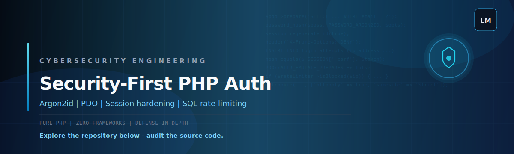

<p align="center">
  
</p>

<p align="center">
  
  
  
  
</p>

## Security-First PHP Authentication

This repository is **precision-engineered from the ground up**: pure PHP, no frameworks, and security choices you can explain in an interview or code review.

I built it to show **custom engineering** with a clear story: **Argon2id** for passwords, **PDO** with prepared statements for the database, **Session Hardening** for realistic browser threats, and **Defense in Depth** (rate limits + CSRF + output escaping + headers).

---

## What you get (technical)

| Topic | What this project does |
| :--- | :--- |
| **Argon2id** | Passwords are hashed with `PASSWORD_ARGON2ID` only. The app checks the hash prefix and refuses non-Argon2id hashes on login. |
| **PDO** | All SQL goes through `PDO::prepare()` / `execute()` with bound parameters. `ATTR_EMULATE_PREPARES` is disabled to keep real server-side prepares. |
| **Session Hardening** | `session_regenerate_id(true)` on successful login, strict session mode, HttpOnly cookies, SameSite, and an optional **Secure** flag via `.env` for HTTPS deployments. |
| **Defense in Depth** | CSRF tokens on auth forms, security headers in bootstrap, IP rate limiting backed by SQL, and escaped HTML output. |

---

## Rate limiting (IP-based)

Failed logins are stored in the **`login_attempts`** table (by IP). After **5 failed attempts** inside the configured time window, the IP is **blocked** for a cooldown period (see `config/config.php`).

---

## Frontend and performance

The UI is **hand-coded HTML and CSS** with a **small vanilla JS** file (`public/assets/app.js`) that only prevents double-submit on POST forms. There are **no UI frameworks** and **no heavy bundles**, which keeps the surface area small for a strong Lighthouse score.

The visual style matches the **dark blue / cyan** banner: deep navy panels, subtle grid, and cyan accents.

---

## Project layout

Keep **`public/`**, **`src/`**, and **`config/`** at the **root of the repository** (not nested inside another folder), so paths and the setup below stay correct.

```text
.
├── readme-banner.svg
├── docs/
│   ├── readme-banner.svg
│   └── github-banner-preview.html
├── config/
│   └── config.php
├── public/
│   ├── assets/
│   │   ├── styles.css
│   │   └── app.js
│   ├── index.php
│   ├── login.php
│   ├── register.php
│   ├── dashboard.php
│   └── logout.php
├── src/
│   ├── bootstrap.php
│   ├── Database.php
│   ├── Repositories/
│   │   └── UserRepository.php
│   ├── Security/
│   │   ├── Csrf.php
│   │   ├── RateLimiter.php
│   │   └── SessionManager.php
│   ├── Services/
│   │   └── AuthService.php
│   └── Support/
│       └── Env.php
├── database.sql
├── .env.example
├── .gitignore
└── README.md
```

---

## Setup

1. Import **`database.sql`** into MySQL (creates `users` and **`login_attempts`**).
2. Copy **`.env.example`** to **`.env`** and set database credentials.
3. Point your web server document root to **`public/`** (the `public` folder in this repo’s root).
4. For production HTTPS, set **`COOKIE_SECURE=true`** in `.env`.

---

## Production checklist (short)

- Force HTTPS and keep **`COOKIE_SECURE=true`**
- Add or tighten CSP / HSTS at the reverse proxy
- Central logging for lockouts and auth errors

---

## Disclaimer

This is a focused authentication demo for learning and portfolio use. Production systems still need broader testing, monitoring, and hardening beyond auth alone.
